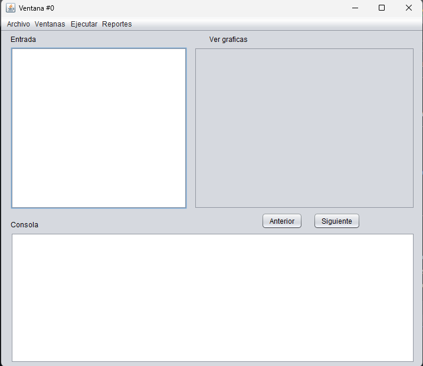
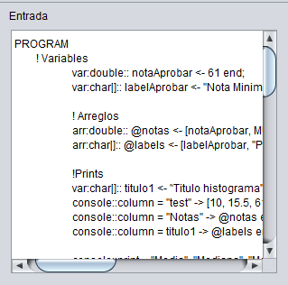
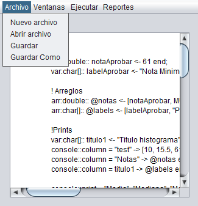
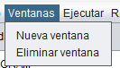
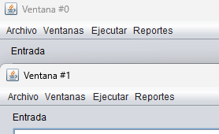
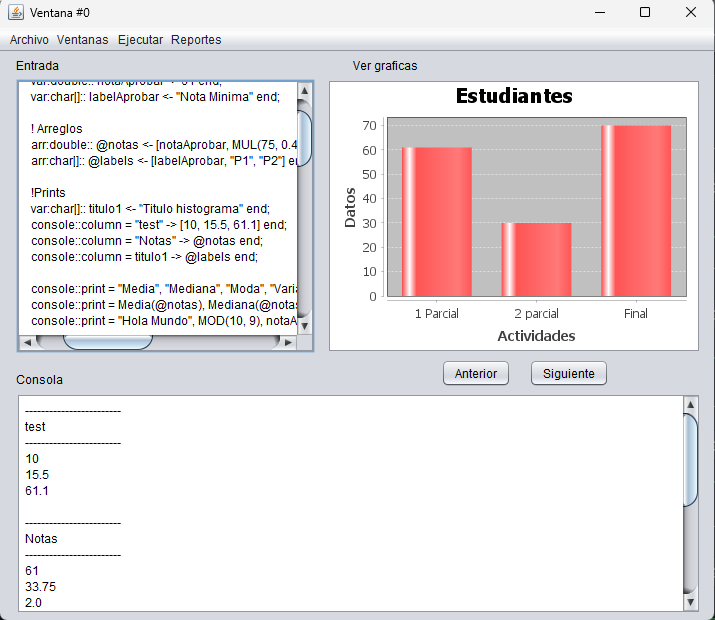
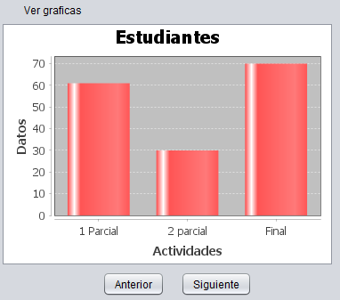
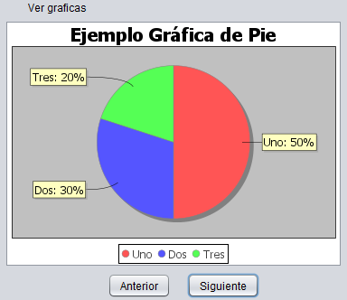

#  **OLC1_Proyecto1_202110509**
## **DataForge**

## **Manual de Usuario**

- **Interfaz Gráfica**
    Al iniciar la aplicación el usuario contará con una interfaz gráfica. Se pueden observar
    distintos apartados y botones.

    

        
    

 

1. **Abrir Archivo**
    Se debe dar clic sobre la el botón ubicado en la barra de herramientas y se deberá elegir el 
    archivo correspondiente, una vez abierto se mostrará el contenido del archivo dentro del apartado
    "entrada"

    

        
        
    

 

2. **Guardar | Guardar Como**
    El usuario tiene la posibilidad de modificar su archivo dentro de la aplicación y guardar los cambios.
    

        
    

 

3. **Ventanas**
    El usuario dispone de un apartado donde puede crear varias ventanas para analizar varios archivos en simultáneo.

    

        
        
    

 

4. **Ejecutar**
    Una vez se tiene un archivo cargado, se debe dar clic en el apartado de Ejecutar para empezar el análisis. En la 
    consola se podrá visualizar el análisis así como las gráficas generadas.

    

        
    

 

5. **Reportes**
    Una vez realizado el análisis dentro de la aplicación, el usuario dispone de diferentes reportes.
    5.1 Tabla de Tokens.
    5.2 Tabla de errores.
    5.3 Tabla de Símbolos 

    

        
        
        
    

 

6. **Graficas**
    La aplicación cuenta con un apartado para visualizar gráficas que son generadas durante el análisis, 
    así mismo se cuenta con dos botones ("Anterior" y "Siguiente") los cuales el usuario puede dar clic 
    y navegar entre las gráficas generadas.

    

        
        
    

 