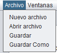

#  
**OLC1_Proyecto1_202110509**

## 
**DataForge**

## **Manual de Usuario**

- **Interfaz Gráfica**

    Al iniciar la aplicación el usuario contará con una interfaz gráfica. Se pueden observar
    distintos apartados y botones.

    

        
    

 

1. **Abrir Archivo**

    Se debe dar clic sobre la el botón ubicado en la barra de herramientas y se deberá elegir el 
    archivo correspondiente, una vez abierto se mostrará el contenido del archivo dentro del apartado
    "entrada"

    

        
        
    

 

2. **Guardar | Guardar Como**

    El usuario tiene la posibilidad de modificar su archivo dentro de la aplicación y guardar los cambios.
    

        
    

 

3. **Ventanas**

    El usuario dispone de un apartado donde puede crear varias ventanas para analizar varios archivos en simultáneo.

    

        
        
    

 

4. **Ejecutar**

    Una vez se tiene un archivo cargado, se debe dar clic en el apartado de Ejecutar para empezar el análisis. En la 
    consola se podrá visualizar el análisis así como las gráficas generadas.

    

        
    

 

5. **Reportes**

    Una vez realizado el análisis dentro de la aplicación, el usuario dispone de diferentes reportes.
    5.1 Tabla de Tokens.
    5.2 Tabla de errores.
    5.3 Tabla de Símbolos 

    

        
        
        
    

 

6. **Graficas**

    La aplicación cuenta con un apartado para visualizar gráficas que son generadas durante el análisis, 
    así mismo se cuenta con dos botones ("Anterior" y "Siguiente") los cuales el usuario puede dar clic 
    y navegar entre las gráficas generadas.

    

        
        
    

 

## **Manual Técnico**

- **Herramientas y Entorno de Desarrollo**

    El proyecto fue realizado en Windows 11, utilizando software libre como el entorno de desarrollo integrado Netbeans y el editor de código Visual Studio Code.

    Trabajando con Java Development Kit 20.

    Las librerías y herramientas utilizadas fueron jfreechart 1.0.19, jcommon 1.0.23, java-cup-11b y jflex-1.9.1.

    

        
    

 

- **Lexer.jflex**

    El archivo lexer.jflex es un archivo de especificación que describe cómo se deben identificar y clasificar los tokens en el código fuente.

    

        
    

 

- **Parser.cup**

    El archivo parser.cup es una especificación para generar un analizador sintáctico (parser) utilizando la herramienta CUP (Constructor of Useful Parsers), que es un generador de parsers para Java.

    

        
    

 

-  **Guardar varibles**

    Dentro de esta clase se utilizaron HashpMap los cuales se instancian dentro del CUP para guardar las variables provenientes del archivo de entrada.

    Para guardar dentro del HaspMap se utiliza el método "put", y se asigna una contraseña y un valor, en este caso la contraseña es el id de la variable y el valor es el valor de la misma. Se cuenta con el método addVariable para guardar dentro del HashMap y el método getVariable para obtener el valor de una variable guardada. 
    
    

        
    

 

-  **Operaciones Aritméticas | Operaciones Estadísticas**

    Dentro de esta misma clase se realizan las operaciones aritméticas o estadísticas, no se utiliza ninguna librería para estos cálculos. Una vez realizado dichos cálculos las funciones retornan un valor en cual es guardado en el HashMap.

    

        
    

 

-  **Información de las Gráficas**

    La clase GraficaBarrasInfo proporciona una estructura para almacenar y manipular la información necesaria para representar una gráfica de barras, incluyendo títulos, etiquetas de ejes y valores de datos. Los atributos y métodos de esta clase se describen a continuación:

    -Atributos:

    titulo: Una cadena de texto (String) que representa el título de la gráfica de barras.

    ejeX: Una lista de cadenas de texto (List) que representa las etiquetas del eje X de la gráfica.

    ejeY: Una lista de números decimales (List) que representa los valores del eje Y de la gráfica.

    tituloX: Una cadena de texto (String) que representa el título del eje X de la gráfica.

    tituloY: Una cadena de texto (String) que representa el título del eje Y de la gráfica.

    -Métodos:

    getTitulo(): Un método getter que devuelve el título de la gráfica.

    setTitulo(String titulo): Un método setter que establece el título de la gráfica.

    getEjeX(): Un método getter que devuelve la lista de etiquetas del eje X.

    setEjeX(List ejeX): Un método setter que establece la lista de etiquetas del eje X.

    getEjeY(): Un método getter que devuelve la lista de valores del eje Y.

    

        
    

 

-  **Almacenar Gráficas**

    Dentro de esta clase se crearon diferentes Listas con el objetivo de guardar los objetos de tipo gráfica e imprimirlos en una sola ejecución. Así mismo se creó un método para limpiar las listas, esto con el objetivo de que al realizar un nuevo análisis no se encontraran grafícas del análisis pasados.

    

        
    

 

-  **Generar Graficas**

    La clase GeneradorGraficas es una clase utilitaria que proporciona métodos estáticos para generar gráficas, como gráficas de barras, a partir de datos y configuraciones específicas. En este caso, la clase contiene un método generarGraficaBarras que toma un objeto GraficaBarrasInfo y una Interfaz como parámetros y devuelve un ChartPanel que contiene la gráfica de barras generada. A continuación, se describe de forma general el proceso realizado por este método:

    Creación del conjunto de datos: Se crea un DefaultCategoryDataset que almacena los datos para la gráfica de barras. Los valores y etiquetas del eje X y Y se obtienen del objeto GraficaBarrasInfo y se agregan al conjunto de datos.

    Generación de la gráfica de barras: Se utiliza la clase ChartFactory para crear un objeto JFreeChart que representa la gráfica de barras, utilizando el conjunto de datos y la información de títulos proporcionada por el objeto GraficaBarrasInfo.

    Configuración de la gráfica: Se realizan ajustes adicionales en la gráfica, como ocultar la leyenda de la serie o configurar otros aspectos visuales según sea necesario.

    Creación del ChartPanel: Se crea un ChartPanel que contiene la gráfica de barras y se ajusta su tamaño preferido basándose en el tamaño del viewport del JScrollPane en la interfaz.

    Agregación de la gráfica a la interfaz: La gráfica se agrega al panel correspondiente en la interfaz de usuario a través de un método de la clase Interfaz.

    Retorno del ChartPanel: El método devuelve el ChartPanel que contiene la gráfica de barras, lo que permite su posterior manipulación o visualización en la interfaz de usuario.

    

        
    

 

-  **Guardar Tokens, Erroes o Símbolos**

    Estas clases almacenan información relevante sobre cada token, error o símbolo, como su fila y columna, el nombre. Además, las clases contienen una lista para almacenar múltiples tokens. Esto es útil para la realización de los reportes donde se solicita informacion sobre tokens, erroes y símbolos.

    

        
    

 

-  **Ejecutar**

    Este método se activa cuando se hace clic en el botón asociado, y su propósito es realizar el análisis léxico y sintáctico de un texto de entrada, además de manejar la visualización de los resultados y posibles errores. A continuación, se describe el proceso realizado por este método:

    Limpieza de la interfaz: Se limpia el área de texto de la consola y se eliminan todos los componentes del panel de gráficas. Luego, se revalida y se repinta el panel para reflejar los cambios.

    Creación de listas para almacenar errores, tokens y símbolos: Se inicializan listas vacías para almacenar objetos de tipo ErroresTipo, Tokens y Simbolos, que se utilizarán para recopilar información durante el análisis.

    Configuración y ejecución del análisis léxico y sintáctico:

    Se crea una instancia del analizador léxico (Lexer) con el texto de entrada obtenido de un área de texto (entradaText) en la GUI.

    Se crea una instancia del analizador sintáctico (Parser) con el analizador léxico como argumento.

    Se establece la interfaz actual (Interfaz.this) en el analizador sintáctico para permitir la comunicación entre el parser y la GUI.

    Se ejecuta el método parse() del analizador sintáctico para iniciar el análisis del texto de entrada.
    Recolección de resultados y errores: Se agregan los errores detectados por el analizador léxico y el analizador sintáctico a la lista de errores. De igual manera, se agregan los tokens reconocidos y los símbolos identificados a sus respectivas listas.

    Generación de reportes HTML: Se invocan métodos para generar archivos HTML con los reportes de errores, tokens y símbolos. Estos métodos toman las listas correspondientes como argumentos y crean archivos HTML con tablas que presentan la información recopilada.

    Manejo de excepciones: Si ocurre una excepción durante el análisis, se muestra un mensaje de error en el área de texto de la consola.

    

        
    

 

-  **Generar Reportes**

    Esta función es un método que toma una lista de objetos, es ente caso Tokens y genera un archivo HTML que presenta un informe de los tokens en una tabla estilizada con Bootstrap. El archivo HTML generado incluye información sobre cada token, como su lexema, tipo, fila y columna en el código fuente. A continuación, se describe el proceso realizado por este método:

    Inicialización de recursos para escritura de archivo: Se crean variables para manejar la escritura del archivo (FileWriter y PrintWriter).

    Apertura y configuración del archivo HTML: Se abre el archivo HTML para escritura y se escribe el código HTML inicial, incluyendo la estructura básica del documento, la inclusión de la hoja de estilos de Bootstrap y algunos estilos personalizados.

    Creación de la tabla de tokens: Se inicia una tabla HTML con encabezados para las columnas correspondientes a la información de los tokens. Luego, se itera sobre la lista de tokens y se agrega una fila a la tabla por cada token, incluyendo su lexema, tipo, fila y columna.

    Cierre de la tabla y del documento HTML: Se cierra la tabla y se escriben las etiquetas de cierre del documento HTML.

    Manejo de excepciones y cierre de recursos: Se manejan posibles excepciones de entrada/salida y se asegura el cierre adecuado de los recursos de escritura del archivo, incluso en caso de error.

    Generación del archivo HTML: Al finalizar la ejecución del método, se genera un archivo HTML en la ruta especificada (Reportes/Tokens.html), que contiene una tabla con la información de los tokens extraídos del análisis léxico.

    

        
    

 

## **Archivo de Gramática**

[Archivo de Gramática txt](Proyecto1/Gramatica/gramatica.txt)

 
